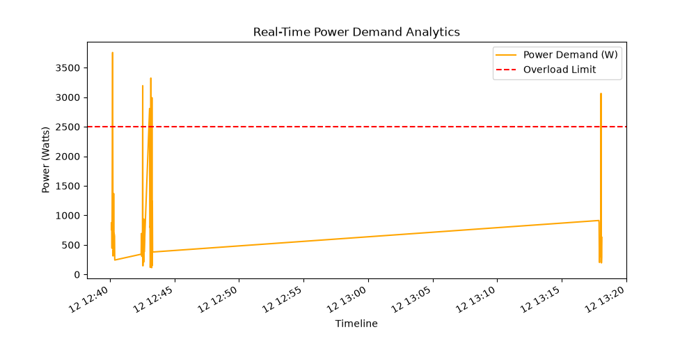

# Smart Home Energy Monitoring System ⚡🔋

An industry-relevant IoT infrastructure built to monitor household electrical loads, calculate real-time pricing metrics, automatically detect overload surges, and compile standard audit reports. 

This project features both a **Production-Ready Python Virtual Simulation Engine** connected to a web cloud, and an **ESP32 Hardware Core Blueprint** for physical implementation.

---

## 🚀 Key Features
- **Real-Time Data Streaming:** Collects and processes current, voltage, power, and cumulative energy consumption.
- **Cloud Dashboard Integration:** Streams live electrical telemetry directly into online web-app charts.
- **Safety Interlock System:** Automated virtual breaker cuts power line continuity during high-power surge conditions.
- **Automated Audit Reports:** Compiles clean analytical line charts and professional PDF energy audit compliance logs.

---

## 🏗️ Project Architecture Layout
```text
[Load Input] ➔ [Current & Voltage Processing] ➔ [Edge Metrics Calculation]
                                                       │
         ┌─────────────────────────────────────────────┴─────────────────────────────────────────────┐
         ▼                                                                                           ▼
[Local Storage: CSV Ledger] ➔ [Automated PDF Reports]       [Cloud Dashboard Platform] ➔ [Live Visual Charts]
```

---

## 📁 System Folder Structure
- `python_simulation/`: Houses the core processing scripts (`main.py` and `config.py`).
- `arduino_code/`: Embedded C++ Coded framework blueprint (`smart_meter.ino`) for ESP32 hardware layers.
- `data/`: Automated storage locker holding history logs (`energy_logs.csv`).
- `outputs/`: Holds dynamically compiled PDF energy summary sheets and visual graphs.

---

## 🛠️ Step-by-Step Setup and Execution Guide

### 1. Pre-requisite Package Setup
Ensure your local environment has the required processing packages installed:
```bash
pip install pandas matplotlib fpdf2 requests
```

### 2. Add Cloud Credentials
Open `python_simulation/config.py` and add your ThingSpeak Write API Key between the quotation marks:
```python
THINGSPEAK_WRITE_API = "PASTE_YOUR_CHANNEL_API_KEY_HERE"
```

### 3. Initialize the System Engine
Run the main analytics simulation script directly from your terminal:
```bash
cd python_simulation
python main.py
```

---

## 📊 Live System Artifacts Generated
- **`data/energy_logs.csv`**: Real-time structured baseline data storage mapping every load loop tick.
- **`outputs/power_chart.png`**: Dynamic load timeline analytics graph outlining system limits.
- **`outputs/Energy_Audit_Report.pdf`**: Industry-grade compliance documentation detailing billing totals, peak usage, and timestamps.
## 📊 System Dashboard Analytics (Sample Output)
Here is the real-time power demand curve generated by the analytics pipeline during system monitoring:


